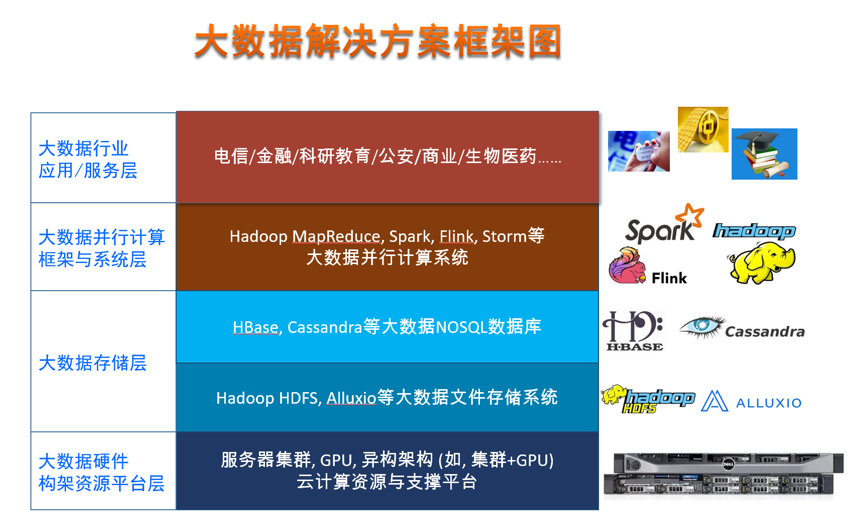

## 杰世欣大数据基础支撑平台解决方案

### 用户现状

近几年来，大数据（Big Data）在全球迅猛发展，已经逐步渗透到各行各业，引起全球业界、学术界和各国政府的高度关注。巨大的数据资源已经成为国家和企业的战略资源。2012年，世界经济论坛发布的报告提出，大数据是新财富，其价值堪比石油；麦肯锡咨询报告认为，大数据是下一个创新、竞争、生产力提高的前沿，数据是一种生产资料。这些大规模数据资源蕴涵着巨大的社会价值和商业价值，有效地管理这些数据、挖掘数据的深度价值，对国家治理、社会管理、企业决策和个人生活将带来巨大的作用和影响。大数据研究和应用已经成为全球科技创新和和经济发展的重要推动力量。

然而，大规模数据资源给人们带来新的发展机遇的同时，也带来很多新的技术挑战。相比于传统处理的小数据，格式多样、形态复杂、规模庞大的行业大数据给传统的计算技术带来了很多技术困难。传统的数据库等信息处理技术已经难以有效应对大规模数据的处理。为此，人们亟需寻找有效的大数据处理技术方法和手段，以有效处理和分析应用行业大数据。

### 解决方案

大数据处理是涉及软硬件系统多个层面的综合性信息处理技术，因此大数据解决方案是多个层面上诸多计算技术的融合。一个完整的大数据处理解决方案自下而上主要包括大数据硬件构架资源平台层、大数据存储层（包括分布式文件存储和NOSQL数据库）、大数据并行计算框架与系统层、以及顶端的大数据行业应用/服务层。杰世欣作为一家大数据基础设施与基础软件的提供商在大数据硬件架构资源层、存储层、并行计算框架与系统层均有完善的解决方案。

我们在各个层面上的解决方案如下：

#### 大数据硬件构架资源平台层

大数据的发展导致对大规模计算和存储资源需求的迅速增长，因此，大数据处理需要基于集群的大规模基础设施和资源来完成。目前大数据处理采用以通用化集群为主的硬件基础架构以满足大数据处理对计算和存储资源的需求。在大数据处理基础设施和资源构架方面，杰世欣设计使用价格合适、性能优良的普通商用服务器构建集群系统以代替昂贵的专用大规模并行计算系统。为了满足计算密集型任务加速处理的需求，我们的解决方案支持用户在集群上添加GPU，以集群CPU＋GPU作为大数据处理基础设施的基本构架。

#### 大数据存储层
在建立了大数据处理基础设施和资源平台之后，大数据处理首先需要解决的是大数据的存储管理问题。在大规模集群环境下，为了提供巨大的数据存储和并发访问能力，业界普遍的共识是利用可扩展的分布式存储技术。首先，底层需要有一个分布式文件系统提供对大规模数据高效可靠的分布式存储管理。分布式文件系统能够以可扩展的方式对大规模数据文件进行有效的存储管理。这方面杰世欣的解决方案中将提供目前主流的大数据分布式文件系统Hadoop HDFS和Alluxio。分布式文件系统通常只提供基于文件方式的基础性大数据存储访问形式，缺少对结构化/半结构化数据的存储管理和访问能力，提供的编程访问接口对于上层很多应用来说也过于底层。因此，杰世欣的解决方案还支持面向结构化和半结构化数据存储管理和查询分析NoSQL大数据存储和查询管理技术和系统，包括Hadoop生态下的HBase和Cassandra等系统。

#### 大数据并行计算框架与系统层
在解决了大数据的分布式存储管理问题之后，通常需要对存储的大规模数据进行快速有效的计算分析。大数据的数据规模之大，使得传统的串行计算方式难以在可接受的计算时间内完成大数据的计算处理。因此，需要提供大规模数据并行化计算技术方法和系统平台。第一代主流的大数据并行计算框架主要是前述的Hadoop MapReduce系统。随着大数据应用的推广，很多实际问题中需要用的大数据处理模式也不尽相同，包括具有高实时低延迟要求的流式计算、具有复杂数据关系的图计算、面向基本数据管理的查询分析类计算，以及面向复杂数据分析挖掘的迭代和交互式分析计算等。因此，为了提高大数据处理的效率，近年来人们研究实现了多种大数据并行计算模型与框架。其中，Spark发展迅猛，受到了工业界和学术界的广泛使用和关注，成为了新一代主流的集多种计算模式于一体的大数据并行计算系统和平台。当前主流的大数据并行处理系统Hadoop MapReduce、Spark以及Flink都包含在我们的解决方案中。

### 用户收益

- **提升大数据存储与计算的性能。** 我们的解决方案采用高可扩展的分布式存储与并计算架构。相比于传统的单节点存储与计算方案，我们解决方案处理大数据存储与计算的性能能提高几倍甚至几十倍以上。
- **部署更加简易和快速。** 我们的解决方案提供软硬件一体化的模式，使硬件与大数据基础软件的部署调试的效率更高，让用户更快速的投入上层大数据应用或服务的开发当中。
- **最大发挥平台建设投资效益。** 我们的解决方案采用当前业界主流的先进技术，最大程度保护现有投资，同时完善的售后服务体系，提供软件技术的咨询培训，以及硬件的升级、更新和优先解决故障等服务。

