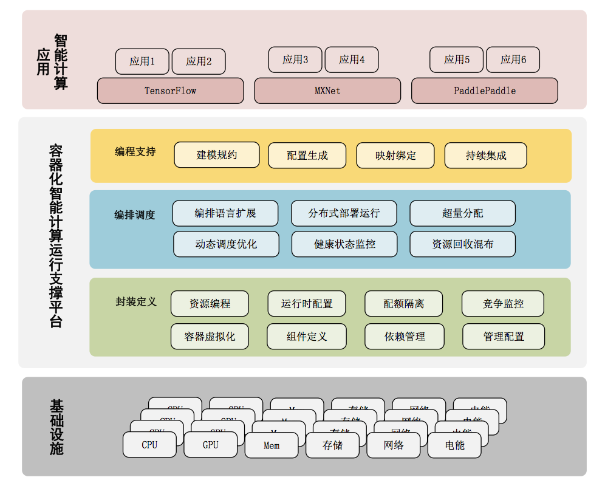

## 杰世欣私有云平台方案

### 用户现状

云计算是一种资源交付和使用模式，指通过网络获得应用所需的资源（硬件、平台、软件）。在“公有云”平台广泛应用的条件下，企业和组织对于“私有云”平台的需求日益增长。相对于由第三方提供资源的公有云计算模式，“私有云”具有安全性、可管理性和灵活性等优点。用户期望基于私有云实现对组织所拥有的基础设施资源进行统一管理和优化使用，在其之上为组织内部各类计算和业务提供支撑。

### 解决方案

杰世欣基于产品Datom给出私有云计算平台整体解决方案。系统整体架构如图所示。

- 在资源封装层，基于容器虚拟化技术和软件定义技术实现应用所需计算、存储、网络等各类资源和相应软件栈的封装；
- 在资源调度层，实现面向云计算的分布式资源调度算法和资源管理技术，支持用户应用在基础设施上的资源使用优化；
- 在应用协同层，面向应用提供应用描述、部署和管理机制，实现包括大数据、分布式高性能计算、数据挖掘与机器学习等各类应用支持；
- 在用户接口层，基于当前先进的UI和接口实现结束，实现用户可视化界面与第三方应用交互接口。

杰世欣私有云计算平台可实现以IaaS、PaaS和SaaS等多种云计算业务模式，支持当前主流分布式并行计算、可伸缩Web服务、大数据人工智能等业务层应用的同时部署和混合运行，并通过Datom核心的资源调度优化技术获得高效资源使用。

### 用户收益

- **低成本** 杰世欣私有云计算平台方案基于一般商业计算设备，支持水平线扩展，用户可从成本极底的基本型配置出发，根据业务量增长同步进行系统扩充，避免一次性投入过大和资源浪费；
- **高效率** 采用杰世欣私有云计算平台用户可实现对多应用的同时部署，并由平台内部的资源隔离技术确保各应用相互不冲突，在资源智能调度技术支持下，提高各应用同时运行时的资源使用效率。
- **便捷使用** 基于容器虚拟化等技术，用户在杰世欣云计算平台上可一键式完成某类型应用的部署，避免了传统手工操作方式需要在多计算节点上部署该类应用所需服务并完成整体配置的复杂操作；
- **全面支持** 杰世欣私有云计算将高性能计算平台、大数据平台、数据分析挖掘框架和机器学习框架等各类应用进行预先封装，提供主流计算业务“开箱即用”的支持，方便用户在平台之上快速直接开发和运行业务系统。

