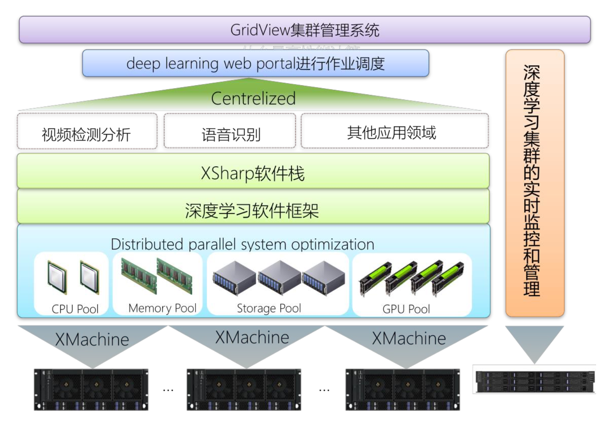

## 杰世欣-曙光深度学习平台

### 用户现状

作为人工智能一个重要分支的深度学习，正在受到业界越来越多的关注。2017年是深度学习高速发展的一年，无论是工业界、学术界都投身到了深度学习之中。深度学习是依赖于人工神经网络模型的一种信息处理系统。理解一个信息处理系统具有三个分析层面，具体包含:

1. 计算理论，对应计算目标和任务的抽象定义;
2. 表示和算法，关于输入和输出如何表示，从输入到输出变换的算法说明;
3. 硬件实现，系统的实际物理实现。

对于相同的计算理论，可以有多重表示和在相应表示上操控符号的算法，也就是说，对于给定的表示和算法，可以有多重硬件实现。根据以上理论，我们可以看出，目前深度学习的主要瓶颈集中在计算能力和算法上。在计算能力方面，深度学习是一个繁重的计算任务，对于深度学习的训练通常需要几十个五十亿的浮点运算(FLOPs)，这在小集群上需要转换为几周或者几个月的时间。在如今迅速变换的环境中，许多组织不能等待如此长的时间来提取智能。在算法方面，深度学习软件模块如果使用开源存储库可以花费企业几天的时间来下载和安装，找到给定深度学习模块或库的所有依赖项会花费更长的时间。

### 解决方案

针对不同行业用户目前在深度学习领域遇到的众多问题，中科曙光凭借自身多年积累的技术优势，从计算角度出发深刻理解深度学习技术，提出了基于“XMachine+XSharp”的机器学习开放框架，底层依托于XMachine一体化硬件平台，上层采用在国内率先提出曙光深度学习XSharp软件栈，硬件加软件的模式帮助用户快速进入深度学习领域，实现企业应用快速成长，将科研成果快速转化为第一生产力。

XMachine是中科曙光为深度学习领域提供的硬件支撑平台，内部集成NVIDIA DIGITS交互式深度学习系统，同时配置GPU计算加速卡以保证计算性能，支持万兆以太网和Infiniband高速互连接口。

XSharp是中科曙光专为深度学习用户而开发的一款软件产品，分别从分布式并行系统优化分布式并行机器学习执行模式优化，大规模机器学习算法工具集三个层面提供深度学习优化策略，帮助用户实现应用优化。目前，曙光XSharp软件产品已经在生物医疗图像处理领域取得成功，实现了对生物医学图像大数据的完美处理。
 

 

### 用户收益

- **提升深度学习性能。** XSharp 软件栈分别从分布式并行系统优化、分布式并行机器学习执行模式优化，大规模机器学习算法工具集三个层面提供深度学习优化策略，帮助用户实现应用优化，可使应用程序的运行速度比传统的GPU加速方案提高几倍以上。
- **部署更加简单和快速。** 软硬件一体化的模式，使系统部署的速度更加快速，让用户更快速的投入到深度学习训练中去。
- **最大发挥投资效益。** 采用目前业界主流的先进技术，最大程度的保护现有的投资，同时完善的售后服务体系，免费提供软硬件的升级、更新和优先解决故障等服务。