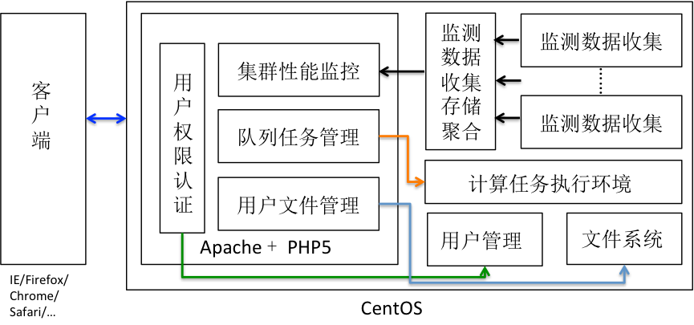

## 杰世欣高性能计算解决方案

### 用户现状

高性能计算（HPC）以解决复杂的科学计算或数值计算问题为目的，由多台节点机（服务器）构成的一种松散耦合的计算集群，各节点通过相应的硬件及高速网络互连，由软件控制，将复杂的问题分解开来，并分配到各个计算节点。每个节点独立运行自己的进程，这些进程之间可以彼此通信，共同读取统一的数据资源，协同完成整个计算任务，以多台计算节点共同运算的模式来换取较小的计算时间。一般主要面向科学计算、工程模拟、动漫渲染等领域，大多属于计算密集型的应用，如天气预报、石油勘探、分子模拟、基因测序等领域，采用MPI进行应用开发，或直接使用VSAP、Matlab、ANSYS等商业化高性能计算软件。

基于集群架构的高性能计算机系统在运算性能达到千万亿次时，其结点的数量也随之迅速地增长。随着系统规模的增长，对系统计算资源进行使用有效管理的需求变得极为迫切。高性能计算集群一般采用Torque、Slurm等任务调度软件实现用户待计算任务的管理、分发和系统资源分配等管理过程，但存在无图像化操作界面、用户需要手工配置各项参数等使用不便之处。此外监控更是集群管理的核心任务。监控数据可用于调度任务、负载平衡、向管理员报告软硬件故障，并广泛地控制系统使用情况。

### 解决方案

杰世欣基于自有产品ParaCluster给出面向各类科学计算任务的高性能计算整体解决方案。系统整体架构如图所示。

ParaCluster是一个基于Web的高性能计算系统管理软件，集群性能监控、集群任务管理和用户管理的软件。ParaCluster主要功能包括：

- 管理任务调度软件资源配置、调度策略和MPI环境等各项参数，对任务队列进行查看、添加、删除和配置等各项操作，实现用户授权和配额管理等；
- 通过高效的实时数据采集、历史数据的存储，监控系统资源使用情况全局视图，包括节点分布、整体负载、运行效率、CPU使用率、内存使用率、磁盘使用率、网络负载、进程运行状况、作业运行分布、队列使用状态分布、用户作业实时统计等，并将其可视化展示；
- 支持用户在Web前端提交各类计算任务至指定队列，并支持通过Web前端对用户文件进行管理。此外，ParaCluster还集成了统一的用户权限认证和管理系统。

ParaCluster实现了集群监控、任务管理、文件管理、用户管理等多种功能为一体的完整功能集合，基于灵活构架，支持高性能计算系统的快速扩展，其轻量级守护进程所带入的系统负载非常少，在对集群不造成压力的情况下实现了动态多功能监控，不会影响用户性能。

### 用户收益

- 普通用户在杰世欣高性能计算平台之上可摆脱原来复杂繁琐的字符型交互使用方式和原始的任务参数配置过程，通过浏览器可完成完整的任务提交流程；
- 管理用户可通过浏览器进行全局各层面资源状态视图，并完成细粒度系统管理，通过监控信息进行统计分析，一方面实现用户计费等基本功能，另一方面也可进一步进行调度参数优化；
- 针对不同行业应用场景，ParaCluster可进行二次开发扩展，非既有支持的高性能计算业务可由杰世欣提供定制化服务实现上述便捷灵活的管理和使用过程。
